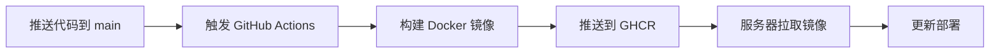

# 🔄 CI/CD 自动化指南

## 📋 概述

本项目配置了 GitHub Actions 自动化工作流，实现代码推送后自动构建 Docker 镜像并推送到 GitHub Container Registry (GHCR)。

## 🚀 工作流程



## ⚙️ 自动化配置

### 触发条件

工作流在以下情况自动触发：

1. **代码推送到 `main` 分支**
   - 自动构建并推送最新镜像
   - 排除 Markdown 和文档文件的变更

2. **创建 Pull Request**
   - 构建测试镜像（不推送）
   - 验证 Docker 构建是否成功

3. **手动触发**
   - 在 GitHub Actions 页面手动运行

### 镜像标签策略

| 触发方式 | 生成的标签 | 说明 |
|---------|-----------|------|
| 推送到 `main` | `latest` | 最新稳定版本 |
| 推送到 `main` | `main-{sha}` | 具体提交的 SHA |
| 创建 Git Tag `v1.3.0` | `v1.3.0` | 版本号标签 |
| 创建 Git Tag `v1.3.0` | `1.3` | 主次版本号 |

## 📦 镜像仓库

**GitHub Container Registry 地址**:
```
ghcr.io/hhtbing-wisefido/owlfront_mock
```

### 查看所有镜像

访问 GitHub Packages 页面：
https://github.com/hhtbing-wisefido/OWLFRONT_MOCK/pkgs/container/owlfront_mock

### 镜像可见性

- 默认：**Public**（公开访问，无需认证）
- 如需设置为 Private，在 GitHub Packages 页面修改

## 🔐 权限配置

GitHub Actions 使用内置的 `GITHUB_TOKEN`，无需额外配置。该 Token 自动具有以下权限：

- ✅ 读取代码仓库
- ✅ 推送镜像到 GHCR
- ✅ 创建和更新 Packages

## 📥 使用预构建镜像

### 服务器部署（推荐）

```bash
# 拉取最新镜像
docker pull ghcr.io/hhtbing-wisefido/owlfront_mock:latest

# 运行容器
docker run -d \
  --name owl-monitor-mock \
  -p 3100:80 \
  --restart unless-stopped \
  ghcr.io/hhtbing-wisefido/owlfront_mock:latest
```

### 使用 Docker Compose

```yaml
services:
  owl-monitor-mock:
    image: ghcr.io/hhtbing-wisefido/owlfront_mock:latest
    container_name: owl-monitor-mock
    ports:
      - "3100:80"
    restart: unless-stopped
```

## 🔄 更新部署

### 手动更新

```bash
# 1. 停止并删除旧容器
docker stop owl-monitor-mock
docker rm owl-monitor-mock

# 2. 拉取最新镜像
docker pull ghcr.io/hhtbing-wisefido/owlfront_mock:latest

# 3. 启动新容器
docker run -d \
  --name owl-monitor-mock \
  -p 3100:80 \
  --restart unless-stopped \
  ghcr.io/hhtbing-wisefido/owlfront_mock:latest
```

### 使用脚本自动更新

创建 `update.sh`:

```bash
#!/bin/bash
set -e

echo "🔄 更新 OWL Monitor Mock..."

# 拉取最新镜像
echo "📥 拉取最新镜像..."
docker pull ghcr.io/hhtbing-wisefido/owlfront_mock:latest

# 停止并删除旧容器
echo "🛑 停止旧容器..."
docker stop owl-monitor-mock 2>/dev/null || true
docker rm owl-monitor-mock 2>/dev/null || true

# 启动新容器
echo "🚀 启动新容器..."
docker run -d \
  --name owl-monitor-mock \
  -p 3100:80 \
  --restart unless-stopped \
  ghcr.io/hhtbing-wisefido/owlfront_mock:latest

echo "✅ 更新完成！访问 http://localhost:3100"
```

Windows PowerShell 版本 `update.ps1`:

```powershell
Write-Host "🔄 更新 OWL Monitor Mock..." -ForegroundColor Cyan

# 拉取最新镜像
Write-Host "📥 拉取最新镜像..." -ForegroundColor Yellow
docker pull ghcr.io/hhtbing-wisefido/owlfront_mock:latest

# 停止并删除旧容器
Write-Host "🛑 停止旧容器..." -ForegroundColor Yellow
docker stop owl-monitor-mock 2>$null
docker rm owl-monitor-mock 2>$null

# 启动新容器
Write-Host "🚀 启动新容器..." -ForegroundColor Yellow
docker run -d `
  --name owl-monitor-mock `
  -p 3100:80 `
  --restart unless-stopped `
  ghcr.io/hhtbing-wisefido/owlfront_mock:latest

Write-Host "✅ 更新完成！访问 http://localhost:3100" -ForegroundColor Green
```

## 🔧 本地开发

### 本地测试 GitHub Actions

使用 [act](https://github.com/nektos/act) 在本地运行 GitHub Actions：

```bash
# 安装 act
# Windows (Chocolatey)
choco install act-cli

# macOS (Homebrew)
brew install act

# 运行工作流
act push
```

### 本地构建镜像

```bash
# 构建镜像
docker build -t owl-monitor-mock:dev .

# 运行测试
docker run --rm -p 3100:80 owl-monitor-mock:dev
```

## 📊 监控构建状态

### GitHub Actions 页面

访问：https://github.com/hhtbing-wisefido/OWLFRONT_MOCK/actions

查看：
- ✅ 构建成功/失败状态
- 📝 构建日志
- ⏱️ 构建时间
- 🏷️ 生成的镜像标签

### 添加 Badge 到 README

在 `README.md` 中添加构建状态徽章：

```markdown

```

## 🐛 故障排查

### 问题 1: 构建失败 - 权限错误

**症状**: 
```
Error: denied: permission_denied: write_package
```

**解决方案**:
1. 确保仓库设置中启用了 Actions 的写入权限
2. 前往 `Settings` → `Actions` → `General` → `Workflow permissions`
3. 选择 "Read and write permissions"

### 问题 2: 镜像拉取失败 - 未找到

**症状**:
```
Error response from daemon: manifest unknown
```

**解决方案**:
1. 确认 GitHub Actions 构建已完成
2. 检查 Packages 页面是否有镜像
3. 确认镜像标签是否正确

### 问题 3: 镜像是私有的，无法拉取

**症状**:
```
Error: denied: access forbidden
```

**解决方案**:
```bash
# 登录 GHCR
echo $GITHUB_TOKEN | docker login ghcr.io -u USERNAME --password-stdin

# 拉取镜像
docker pull ghcr.io/hhtbing-wisefido/owlfront_mock:latest
```

## 🚀 高级配置

### 多平台构建

当前配置已支持多平台（AMD64 + ARM64）：

```yaml
platforms: linux/amd64,linux/arm64
```

### 缓存优化

使用 GitHub Actions Cache 加速构建：

```yaml
cache-from: type=gha
cache-to: type=gha,mode=max
```

### 自定义触发条件

修改 `.github/workflows/docker-publish.yml`:

```yaml
on:
  push:
    branches:
      - main
      - develop  # 添加其他分支
    tags:
      - 'v*'     # 标签触发
```

## 📚 相关资源

- [GitHub Actions 文档](https://docs.github.com/en/actions)
- [GitHub Container Registry 文档](https://docs.github.com/en/packages/working-with-a-github-packages-registry/working-with-the-container-registry)
- [Docker Build Push Action](https://github.com/docker/build-push-action)
- [Docker Metadata Action](https://github.com/docker/metadata-action)

## 📝 版本历史

| 版本 | 日期 | 说明 |
|------|------|------|
| v1.3.0 | 2026-01-12 | 添加 CI/CD 自动构建和推送 |
| v1.2.0 | 2025-12-30 | 完善 Mock 账号系统 |
| v1.1.0 | 2025-12-30 | 登录页面国际化 |
